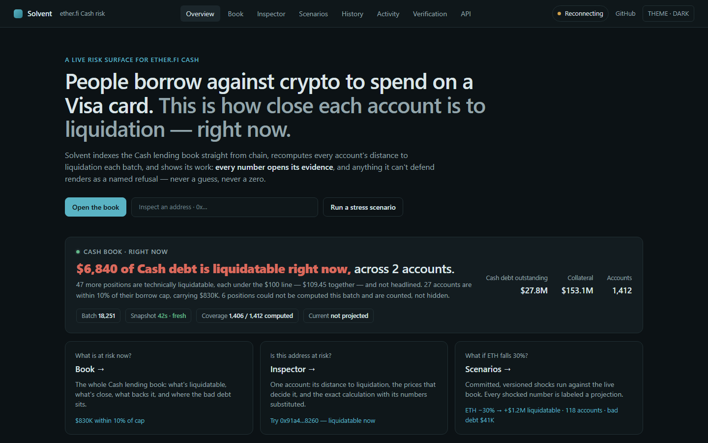
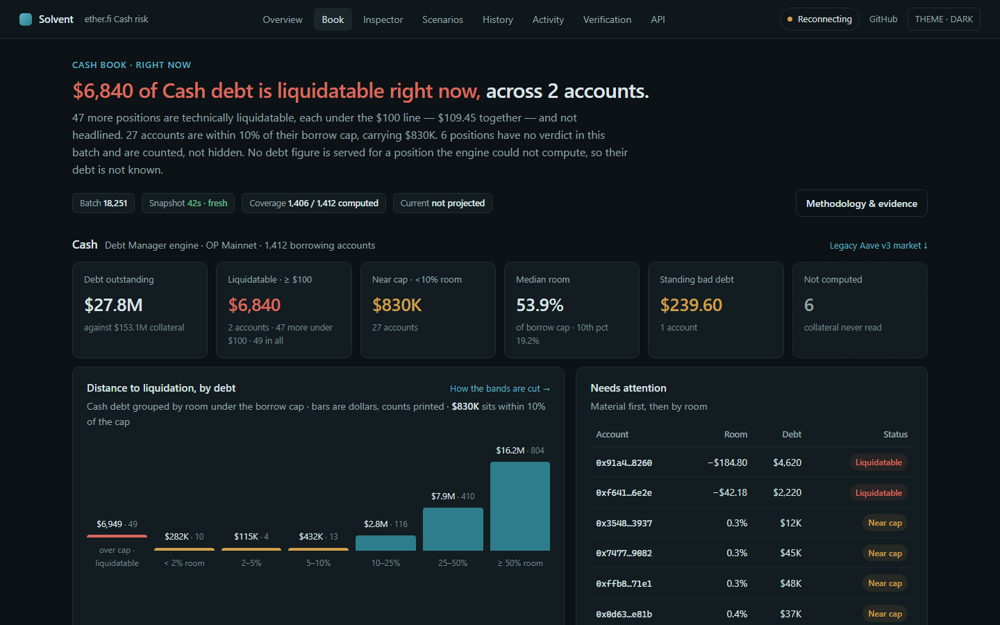
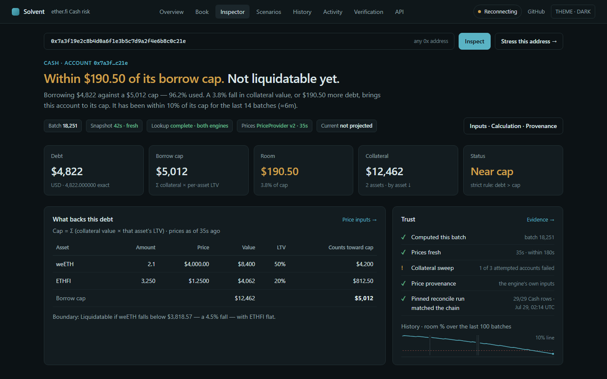
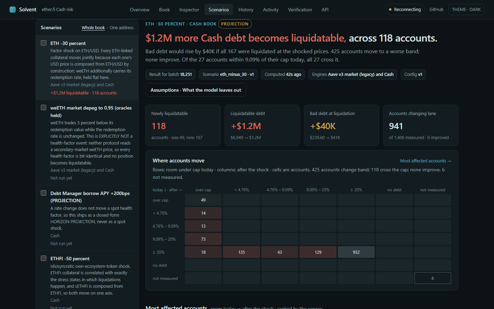
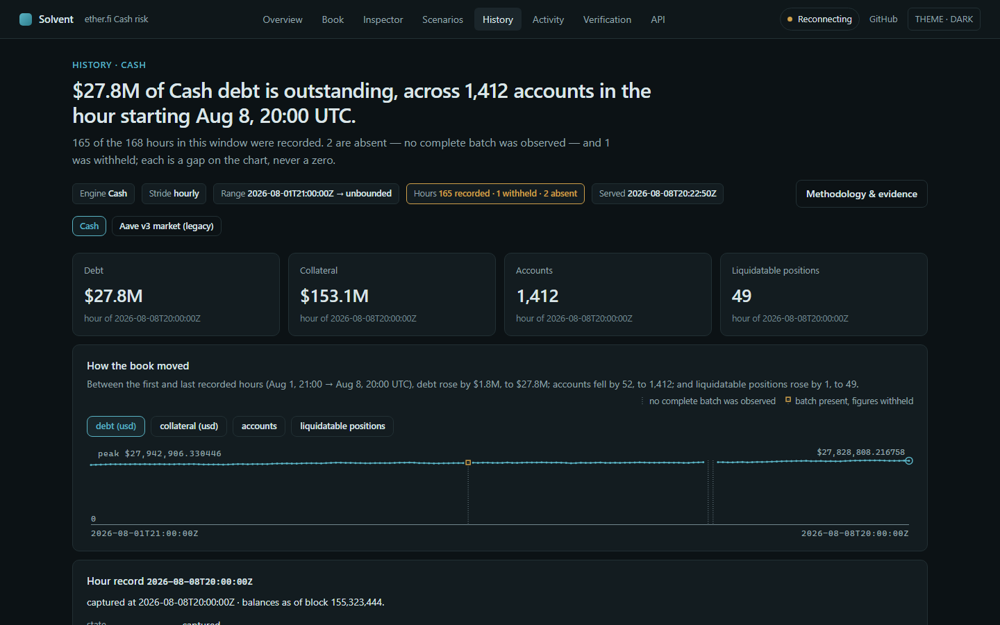
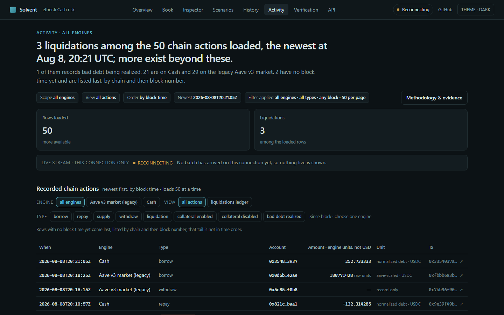
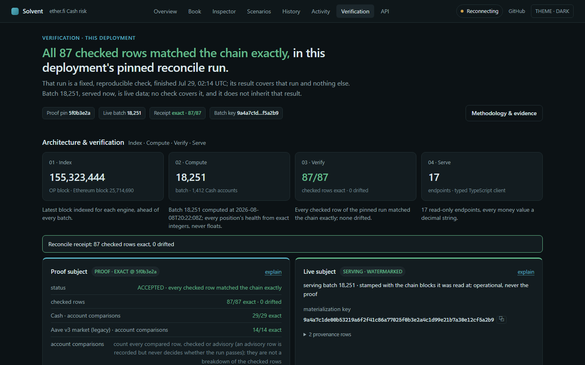
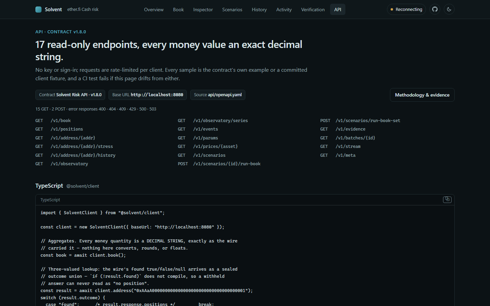

# Solvent


A read-only risk surface for ether.fi Cash, where people borrow against crypto to spend on a
Visa card. Solvent reads the Cash lending contracts on OP Mainnet and Ethereum, rebuilds every
position from chain logs and periodic collateral sweeps, computes how close each account is to
liquidation in exact integer arithmetic, and serves the result through an OpenAPI-contracted
REST + SSE API and an eight-page web app. It holds no funds, sends no transactions, connects no
wallet and has no user accounts. A portfolio project, not affiliated with ether.fi.



*The Overview, rendered from the demo dataset (test fixtures, not chain data). The other seven
pages are under [Screenshots](#screenshots).*

**Status (2026-09-24).** Built and tested on a development machine. Not publicly deployed; the
deploy target is not yet decided. `@solvent/client` is not published to npm. Alerts are planned
(roadmap phase P4), not built. CI (`.github/workflows/ci.yml`) runs gofmt and vet, the Go suite
against Postgres with and without the race detector, and the web app's typecheck, lint, build and
Playwright suite. The pixel-screenshot pins are a local gate: they skip when `CI` is set.

## What it is

Two lending engines, each judged by its own rule. Every aggregate is per engine, and the two are
never summed.

| Engine | Chain | Wire id | Verdict |
| --- | --- | --- | --- |
| The Cash Debt Manager | OP Mainnet (chain ID 10) | `debt_manager` | a strict `liquidatable` boolean over 6-decimal USD |
| The legacy Aave v3 ether.fi market | Ethereum (chain ID 1) | `aave_v3_etherfi` | a continuous health factor: a WAD (1e18-scaled) ratio of threshold-weighted collateral to debt, both valued in the pool's 8-decimal base currency; liquidatable below 1.0 |

The web app has eight pages:

| Page | Route | What it shows |
| --- | --- | --- |
| Overview | `/` | The front door: an address box, the Cash book's current headline, and how the pipeline works. |
| Book | `/book` | The Cash book walked page by page: what is liquidatable, what is near the cap, what could not be computed and why; the legacy market's own finding beneath it. |
| Inspector | `/inspector/<address>` | One address: its position and verdict, backing collateral, stress results, history, recorded activity, and a five-item trust checklist. |
| Scenarios | `/lab` | The committed price-shock scenarios run against the whole book, and what the model leaves out. |
| History | `/observatory` | The hourly record of each engine's debt, collateral, accounts and liquidatable positions. |
| Activity | `/feed` | Borrows, repays, supplies, withdrawals and liquidations, as recorded from the chain. |
| Verification | `/proof` | The committed reconcile receipt, and the identity of the batch being served. |
| API | `/developers` | The contract's endpoints, with samples generated from `api/openapi.yaml`. |

## Screenshots

The other seven pages, captured like the Overview above: demo dataset, dark theme, 1440 × 900.
The demo dataset is the set of test fixtures the Playwright specs route in place of the API, and
the live stream is not connected in these captures, so the header reads "Reconnecting". The
verification figures in the pictures (87 checked rows, 29 of 29 Cash account comparisons exact,
a run finished 2026-07-29) come from the demo's sample receipt, which is the contract's own
example. They are not the committed receipt described under
[The reconcile receipt](#the-reconcile-receipt) (30,838 checked rows, run on 2026-08-02).

| | |
| --- | --- |
|  Book |  Inspector |
|  Scenarios |  History |
|  Activity |  Verification |
|  API | |

To regenerate them, start a production build (`cd web && npm run build && npm run start`), then
from `web/` run `node scripts/screenshot-pages.mjs ../docs/readme overview book inspector lab
history activity verification api` and keep each page's `-dark-fold.png` (the script also writes
light and full-page captures). It imports the TypeScript fixtures directly, so it needs Node
22.18 or later on 22.x, or Node 24 or later.

## How it works

```text
 OP Mainnet (chain 10)                     Ethereum (chain 1)
 Debt Manager                              Aave v3 ether.fi Pool + its aTokens,
                                           PoolConfigurator, Chainlink price feeds
        |   eth_getLogs windows (2,000 blocks, 5 confirmations)
        |   + periodic on-chain collateral sweeps for the Debt Manager
        v
 cmd/indexer    the single indexer writer (a Postgres advisory lock); owns and runs
        |       the migrations; raw logs -> decoded events -> derived positions,
        |       prices, params, sweeps
        v
 PostgreSQL 16
        |
        v
 cmd/riskd      zero RPC calls; recomputes when the derived-state watermark vector moves;
        |       one append-only risk batch per recompute
        v
 cmd/api        REST + SSE (/v1/stream); zero RPC calls; read-only; never migrates;
        |       refuses to start against a schema version other than its own
        v
 @solvent/client (packages/client-ts)   types generated from api/openapi.yaml
        |
        v
 web/ (Next.js)  eight pages; @solvent/client is its only data path

 cmd/reconcile  read-only acceptance harness: derived state vs direct chain reads at hash-pinned blocks
 alerts         planned (P4), not built
```

- **Positions are derived state.** Raw chain logs are stored as the source of truth and positions
  are derived from them, with two exceptions on the Debt Manager. Its collateral is the live
  token balance of each borrower's Safe, which no event tracks, so the indexer reads it with
  periodic on-chain view sweeps (`internal/snapshot`). And the debt its migration genesis seeded
  is carried in each migration transaction's calldata (the log carries only the token and a
  count), so the deriver reads that calldata (`internal/derive/debtmanager.go`).
- **Refusals are rows, not errors.** A position that cannot be valued honestly is served as a
  refused row naming its reason and counted in every containing aggregate's refusal count
  (`api/openapi.yaml`, `cmd/api/handlers.go`).
- **The contract is `api/openapi.yaml`.** Every money quantity on the wire is a decimal string,
  never a JSON number.

## Where to look first

- **Reorg recovery.** `internal/ingest/walker.go`, `rewindToVerifiedAncestor`: when a stored
  block hash no longer matches the chain, the walker walks its stored logs down to one the chain
  still agrees with and rewinds there. Test: `TestDeepForkWalksBackToVerifiedAncestor` in
  `internal/ingest/walker_test.go`; the reasoning: [D-003](roadmap/decisions/D-003-verified-ancestor-reorg-protocol.md).
- **Exact-integer risk math.** `internal/risk/aave.go` lays out the Aave health-factor pipeline
  step by step, with the rounding direction of each step. `TestNoFloatAnywhereInNonTestSources`
  (`internal/risk/floatcheck_test.go`) type-checks the package's non-test sources and fails if any
  expression has a float type or `big.Float` is used, and `TestFloatCheckerCatchesInferredFloats`
  proves that check can fail.
- **The reconcile harness.** `cmd/reconcile/main.go`: its package comment gives the phase order
  (preflight, one read-only database snapshot, chain reads at pinned blocks, a rewind re-check,
  the verdict). Its committed output is
  [`drift-report.json`](roadmap/evidence/artifacts/w1-reconcile/drift-report.json).
- **Contract first.** `api/openapi.yaml` is the source. `cmd/api`'s tests validate served
  responses against it, and `TestContractValidatorCanReject` (`cmd/api/seeded_db_test.go`)
  proves the validator can reject. The client's types in
  `packages/client-ts/src/generated/schema.ts` are generated from it.

## What is verified

Each claim below names its code and tests, and its approval of record: the commit that the
project's adversarial reviewer approved (see [How the work is reviewed](#how-the-work-is-reviewed)),
the date, and the ledger that records the verdict. A claim is vouched for as of that commit. Each
row also says whether the component changed afterwards; [Changes since approval](#changes-since-approval)
names every later change that has no closing approval recorded.

| Claim | Where it lives | Approval of record |
| --- | --- | --- |
| **Reorgs of any depth are recovered.** When a stored cursor's block hash no longer matches the chain, the walker walks its stored logs downward until one's block hash matches the live chain and rewinds there; forks are suffixes, so this is safe at any depth, unlike a fixed-distance rewind. | `internal/ingest/walker.go` (`rewindToVerifiedAncestor`), [D-003](roadmap/decisions/D-003-verified-ancestor-reorg-protocol.md), `TestDeepForkWalksBackToVerifiedAncestor` and the walker's rewind suite | `internal/ingest` approved at `7e58317` (2026-07-26), round 18 in the [Phase 2 ledger](.superpowers/sdd/progress-phase2.md); the Phase 2 exit review of the whole branch closed approved on 2026-07-27. Unchanged since. |
| **The derived state matches the chain.** The committed reconcile receipt; figures [below](#the-reconcile-receipt). | `cmd/reconcile`, [drift-report.json](roadmap/evidence/artifacts/w1-reconcile/drift-report.json), [receipt](roadmap/evidence/receipts/E-w2-acceptance.md) | `cmd/reconcile` approved at `c644dc9` (2026-07-30), Task 6 round 15 in the [Phase 3 ledger](.superpowers/sdd/progress-phase3.md). Every later change was reviewed in the pre-receipt review train, which closed approved at its round 9 on `1b56d77` (2026-08-01); unchanged since then. |
| **Money is exact integers.** The wire carries decimal strings; `internal/risk` computes with no float-typed value and performs no I/O; `@solvent/client` parses the strings to `bigint` and throws rather than rounds. | `TestNoFloatAnywhereInNonTestSources` (a go/types check), `TestPackageIsIOFree`, `packages/client-ts` | `internal/risk` approved at `8a56e16` (2026-07-29, Task 4); `packages/client-ts` at `15becd9` (2026-07-30, Task 8); `cmd/api` at `bc0c703` (2026-07-30, Task 7); all in the [Phase 3 ledger](.superpowers/sdd/progress-phase3.md). Later changes: partly reviewed; see [below](#changes-since-approval). |
| **The API, the contract and the client agree.** `cmd/api`'s tests validate handler responses against `api/openapi.yaml` with kin-openapi and prove the validator can reject; the contract's run-book examples are bodies the production handlers serve; the client's types are generated from the contract and its fixtures are checked contract-valid. | `cmd/api/fixture_db_test.go` (`loadContract`), `TestContractValidatorCanReject`, `TestRunBookExampleIsAServedBody`, `packages/client-ts/test/fixtures.test.ts` | `cmd/api` and `packages/client-ts` as above. `api/openapi.yaml`: the review train that made its run-book examples served bodies closed approved at round 39 on `7561ebc` (2026-08-04), and its last change, `e3f3de1` (contract 1.8.0), is in the train that closed approved at round 67 on `c11bc0b` (2026-08-06); both in the [Phase 3 ledger](.superpowers/sdd/progress-phase3.md). Unchanged since; two earlier changes have no closing approval recorded ([below](#changes-since-approval)). |
| **Each engine's verdict is computed by that engine's own rule.** The Aave health factor and the Debt Manager's strict boolean are separate code paths; every rounding direction is pinned in tests by on-chain integers read at hash-bound blocks. | `internal/risk` (see its package comment), `internal/riskfeed`, `cmd/riskd`, `recon/p3-probes.md` | `internal/risk` as above; `cmd/riskd` and `internal/riskfeed` approved at `4c10793` (2026-07-29, Task 5), in the [Phase 3 ledger](.superpowers/sdd/progress-phase3.md). Later changes: partly reviewed; see [below](#changes-since-approval). |
| **riskd and the API make zero RPC calls; the API never writes.** Import-graph tests keep every chain client out of both binaries; a scan of the API's SQL finds no writing statement; the API never migrates. | `TestRiskdLinksNoChainClient`, `TestAPILinksNoChainClient`, `TestAPIIssuesNoWritingSQL`, `TestAPINeverMigrates` | `cmd/api` and `cmd/riskd` as above. Later changes: partly reviewed; see [below](#changes-since-approval). |
| **Replays against forked mainnet (opt-in).** `make test-fork-replay` checks derived Debt Manager borrower state bit-exactly against direct view calls on a local anvil fork of OP at a hash-pinned block; `make test-pipeline-replay` drives the whole ingest, decode and derive pipeline over three legs on anvil forks of Ethereum, one of them a manufactured governance change that is reorged. | `internal/forkreplay`, `internal/pipelinereplay` | `internal/forkreplay` approved at `f74ef23` (2026-07-27, Phase 2 Task 10 round 22, [Phase 2 ledger](.superpowers/sdd/progress-phase2.md)); unchanged since. `internal/pipelinereplay` approved at `cce2cf1` (2026-07-29, Phase 3 Tasks 2 and 3, [Phase 3 ledger](.superpowers/sdd/progress-phase3.md)); its later change `8ae5774` has no closing approval recorded. |

### Changes since approval

A review train is a run of Codex rounds on one piece of work. Under the project's policy a train
closes only when a round finds nothing new. Every train named here is recorded in the
[Phase 3 ledger](.superpowers/sdd/progress-phase3.md) and named by the round that closed it; the
pre-receipt review train (its rounds 1 to 9) is the one that ran before the committed reconcile
receipt. The commits are those that `git log <approved>..HEAD -- <path>` lists.

- **`internal/ingest`** and **`internal/forkreplay`**: unchanged.
- **`cmd/reconcile`** (approved at `c644dc9`): every later change, `4ff71f0` through `1b56d77`,
  is in the pre-receipt review train, which closed approved at its round 9 (2026-08-01).
- **`internal/risk`** (approved at `8a56e16`):
  - `559828c`, the Aave health factor's rounding (the debt leg rounds up, and the division
    follows the pool's half-up `wadDiv`). Codex confirmed its arithmetic and returned
    documentation findings, fixed inside `internal/risk` by `c680f78` and `d64c9cb`; no closing
    approval is recorded for the change.
  - `9b330c7`, the scenario matrices claim every asset the chain configures. In the pre-receipt
    review train's first round; that train closed approved at its round 9.
  - `9ee3207`, the Debt Manager's USD scale is a fixed constant, never inferred from prices.
    Approved at round 7 of the pre-receipt review train.
  - `e4d9b03`, the Aave verdict is set on every computed row, never left absent. No closing
    approval is recorded for it.
  - `c780b2c` and `196356a`, the ETH price-shock scenarios at −40%, −50% and −60%. Closed
    approved at round 42 (2026-08-04).
- **`cmd/riskd`** and **`internal/riskfeed`** (approved at `4c10793`): `62c6196` through
  `06d0a25`, the collateral-flag custody work, are in their own review train, which closed
  approved at its round 8 (2026-07-30); `a04481f` and `9ee3207` are in the pre-receipt review
  train. No closing approval is recorded for `559828c` (above; it also changed
  `internal/riskfeed/assemble.go`) or `e4d9b03` (above).
- **`cmd/api`** (approved at `bc0c703`): no closing approval is recorded for `4ff42a7` and
  `539a268` (the handlers for the endpoints contracts 1.1.0 and 1.2.0 added), `e4d9b03` (the Aave
  verdict in the API's reads, and a CORS preflight that admits `Cache-Control`) or `8fffea7`
  (test expectations only). Every other later change is in a train that closed approved: the
  pre-receipt review train (its round 9, 2026-08-01) or the trains closed at rounds 26
  (2026-08-03), 34 (2026-08-03), 39 (2026-08-04), 42 (2026-08-04), 54 (2026-08-05) and 67
  (2026-08-06).
- **`packages/client-ts`** (approved at `15becd9`): no closing approval is recorded for `2ab0f22`
  (the client binds the global `fetch` it captures), `53aab06` and `529642d` (the generated types
  for contracts 1.1.0 and 1.2.0, and nine new methods; `529642d` also widened the parameter type
  of `positionVerdict` in the decimal module), `e4d9b03` (the stream's fetch no longer sends
  `Cache-Control`) or `3b6bcf4` (`assertScale` also refuses negative zero; recorded in the
  [UI ledger](.superpowers/sdd/progress-ui-overhaul.md)). Every other later change is in a train
  that closed approved: the pre-receipt review train or the trains closed at rounds 26, 34, 39,
  54 and 67.
- **`api/openapi.yaml`**, since `cmd/api`'s approval at `bc0c703` (contract 1.0.0): no closing
  approval is recorded for `53aab06` and `529642d` (contract versions 1.1.0 and 1.2.0). Every
  other change to it is in a train that closed approved: the pre-receipt review train or the
  trains closed at rounds 26, 34, 39, 54 and 67.
- **`internal/pipelinereplay`** (approved at `cce2cf1`): `8ae5774` moved the harness onto riskd's
  own gate (`riskfeed.GateEpochs`); no closing approval is recorded for it.

**Built and tested, not listed above.** The web app has unit specs on its view models in
`web/lib` and Playwright end-to-end specs, and it has been through adversarial review rounds, but
no closing approval is recorded for its current tree. That includes the web's own contract
check, `web/tests/unit/proof-contract-fidelity.spec.ts`, which re-extracts the API page's
load-bearing fields from `api/openapi.yaml` on every unit run.

## The reconcile receipt

`cmd/reconcile` compares derived state with direct chain reads at hash-pinned blocks, and the
chain is the expected side of every comparison. The committed run, from
[`roadmap/evidence/artifacts/w1-reconcile/drift-report.json`](roadmap/evidence/artifacts/w1-reconcile/drift-report.json):

| | |
| --- | --- |
| Run | 2026-08-02, 01:54:05 to 02:42:31 UTC, acceptance posture |
| Pins | Ethereum block 25,664,030 and OP block 155,018,419, each hash-checked against the chain before and after the run |
| Checked rows (`gated_rows`), the rows that must match for the run to pass | 30,838: 30,838 exact, 0 drift |
| Result | pass, 0 gated failures |
| Advisory rows, recorded beside the verdict | 699 |
| Comparison sha256 | `a34d7a53af58a117c74333f156864de73f13927f6d41f2c8d4b6485c287978e0` |

The API serves this artifact's summary at `/v1/evidence` and marks it accepted only when the
receipt passed with every checked row exact and no drift; otherwise it is served as rejected,
naming the failed condition (`cmd/api/p5_evidence.go`). `make reconcile` re-runs the harness
against your own database, strictly read-only; its golden reads need an archive-capable Ethereum
RPC in `SOLVENT_RECON_RPC_ETH`.

## Run it locally

You need Go 1.24 or later, Docker with Compose, Node.js 22 (22.18 or later) or 24 and later (CI uses Node 22), and RPC
endpoints for OP Mainnet and Ethereum mainnet. No Go binary reads `.env` itself: the Makefile
exports it for its targets.

```sh
cp .env.example .env
# Edit .env: set SOLVENT_RPC_OP and SOLVENT_RPC_ETH to endpoints you control
# (one URL, or a comma-separated list the client fails over between).
make db-up          # Postgres 16 in Docker: `solvent` (live) and `solvent_test` (scratch)
make run-indexer    # runs the migrations, then walks both chains from each stream's
                    # start block in config/contracts.json
```

Once the indexer has started (riskd and the API refuse to start against any other schema
version), run each of these in its own terminal from the repository root:

```sh
set -a; . ./.env; set +a    # riskd has no make target: export .env into this shell
go run ./cmd/riskd          # writes a risk batch whenever the indexed state moves
```

```sh
make run-api                # REST + SSE on :8080; reads the same .env
```

```sh
cd web
npm ci
npm run dev                 # http://localhost:3000; reads the API at NEXT_PUBLIC_SOLVENT_API_URL
                            # (default http://localhost:8080)
```

riskd and the API both load `config/contracts.json` at startup, so `SOLVENT_DATABASE_URL`,
`SOLVENT_RPC_OP` and `SOLVENT_RPC_ETH` must be set for each of them, even though neither binary
dials an RPC: each refuses to start without them, whatever its own database variable says. For
the database connection itself, riskd prefers `SOLVENT_RISKD_DATABASE_URL` (the `solvent_riskd`
role, which migration 00013 creates without a login: read-only on the indexer's tables) and the
API prefers `SOLVENT_API_DATABASE_URL` (for a SELECT-only role). Either one unset, that binary
connects with `SOLVENT_DATABASE_URL`, and each logs a warning when it does.

The served app has no demo mode: with no API running, the Book, Scenarios, History, Activity and
Verification pages each say in their headline what they could not fetch. The demo dataset exists
only as test fixtures, which the Playwright specs and the screenshot script route in place of the
API.

### Tests

Two `cmd/reconcile` tests read ether.fi's cash-v3 contract source, which is not committed here.
Clone it at the commit these tests pass against (CI fetches the same commit), then run the suites:

```sh
git clone https://github.com/etherfi-protocol/cash-v3 recon/cash-v3
git -C recon/cash-v3 checkout 247faab2206cb651e2e81b2331404eed841145b8

make test                                  # Go; DB-backed tests use solvent_test (TEST_DATABASE_URL)
(cd packages/client-ts && npm ci && npm test)
(cd web && npm ci && npm run build && npx playwright install chromium && npm run test:e2e)
```

- `make test` includes one read-only smoke of the live `solvent` database: it checks that the
  API's schema gate refuses a database that was never migrated or is at another version, and
  passes one at this build's version.
- `make test-acceptance` fails on any skipped test. `make test-fork-replay` and
  `make test-pipeline-replay` are opt-in: they need `ANVIL_BIN` and an archive-capable RPC
  (`ANVIL_FORK_RPC` for OP, `ANVIL_FORK_RPC_ETH` for Ethereum), and skip without them. The fork
  replay reads your backfilled `solvent` database; the pipeline replay derives its own scratch
  databases from `TEST_DATABASE_URL`.
- `npm run test:e2e` runs the unit project (no browser) and the end-to-end project against a
  production build on port 3111. The pixel pins in `web/tests/e2e/screenshots.spec.ts` compare
  against baselines rendered on one development machine, so on any other machine they can fail
  on font rendering alone. `CI=1 npm run test:e2e` skips them; with `CI` set, Playwright also
  starts its own server on port 3111 and will not reuse one already running there.

## Repository map

| Path | What |
| --- | --- |
| `api/openapi.yaml` | The contract; its `info.version` is the contract version |
| `cmd/indexer` | Ingest, decode, derive, prices, collateral sweeps, health endpoint; owns the migrations |
| `cmd/riskd` | The risk materializer |
| `cmd/api` | The REST + SSE read surface |
| `cmd/reconcile` | The read-only acceptance harness that writes the drift report |
| `cmd/backfill-blocktimes` | A one-shot block-time backfill, refused unless `SOLVENT_BACKFILL_BLOCKTIMES=1` |
| `internal/` | `chain` (RPC failover), `config`, `decode`, `derive`, `ingest` (the walker), `prices`, `risk` (pure math), `riskfeed`, `snapshot` (collateral sweeps), `store` (Postgres and every migration), `forkreplay`, `pipelinereplay` |
| `packages/client-ts` | `@solvent/client`, the typed TypeScript client (private; not published) |
| `web/` | The Next.js app; see [web/README.md](web/README.md) |
| `config/contracts.json` | Chains, streams, addresses and start blocks |
| `recon/` | ABIs, the oracle feed registry, derivation notes and probe records |
| `roadmap/` | The control plane: vision, roadmap, status, decisions, evidence receipts and artifacts |
| `docs/` | Design specs and implementation plans |
| `.superpowers/sdd/` | Execution ledgers: every review round, its verdict and its session id |

## How the work is reviewed

Under the project's review policy, every correctness-critical component (money math, chain-state
derivation, reorg and consistency invariants, persistence of source-of-truth data) gets an
adversarial review from OpenAI's Codex on top of the standard per-task review, and is not trusted
until Codex approves it: a fix wave on a Codex finding goes back to Codex until a round finds
nothing new ([D-006](roadmap/decisions/D-006-codex-approval-gate.md)). Each claim under
[What is verified](#what-is-verified) names its approval of record and says whether the component
changed since. The bar is honest-use correctness: a finding that could give an honest user or
operator a wrong answer is fixed, and one that needs a hostile operator is disclosed
([D-013](roadmap/decisions/D-013-honest-use-correctness-bar.md)). Verdicts and session ids are in
the execution ledgers under `.superpowers/sdd/`.

## License

[MIT](LICENSE)
